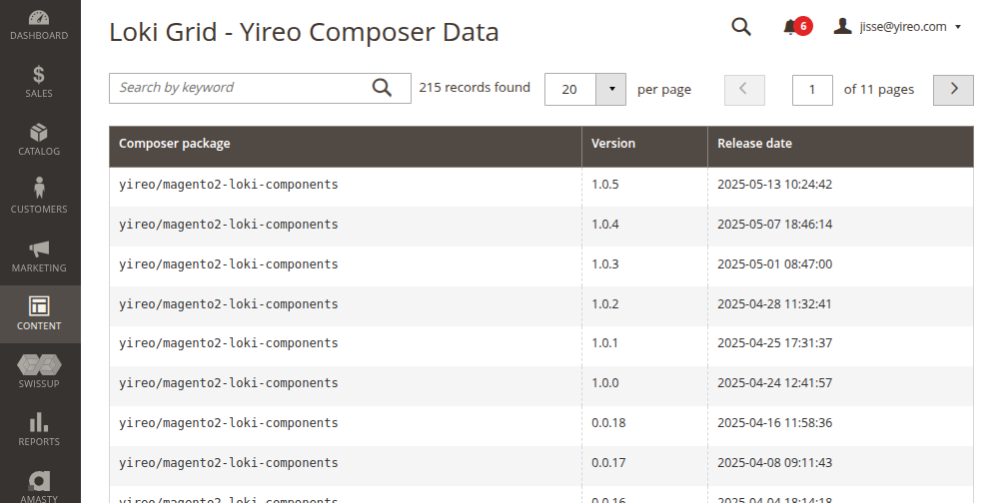

# YireoTraining_ExampleLokiAdminArrayGrid

**This Magento 2 module demos the usage of [Loki_AdminComponents](https://github.com/LokiExtensions/Loki_AdminComponents) to code a grid with ease.**

### Installation
```bash
composer require yireo-training/magento2-example-loki-admin-array-grid@dev
bin/magento module:enable YireoTraining_ExampleLokiAdminArrayGrid
```
### Usage
Navigate via the menu **Content > Pages (Loki)**.

Note that this example module is not about the usage, it is about the code. See how little code was involved to create this grid.


